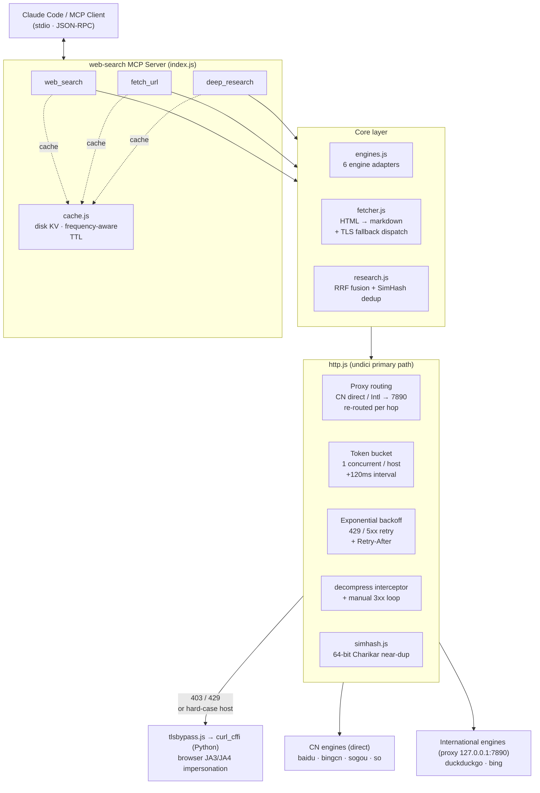
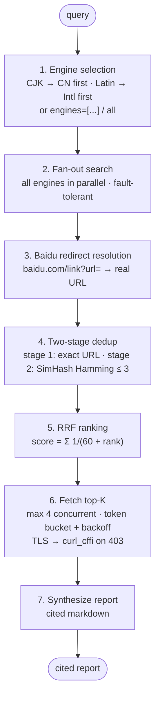

# web-search MCP server

[](https://modelcontextprotocol.io)
[](https://nodejs.org)
[](#license)

A self-hosted **web search MCP server** for Claude Code / any MCP client. Multi-engine (CN-direct + international-via-proxy auto-routing), three tools, and research-backed optimizations: RRF rank fusion, SimHash near-duplicate dedup, per-host rate limiting, frequency-aware caching, and TLS/JA3 fingerprint impersonation fallback.

[中文文档](./README.zh.md)

---

## Installation

### Prerequisites

- **Node.js ≥ 18**
- **Python 3** + `curl_cffi` (optional, for TLS impersonation on protected sites):

  ```bash
  pip install curl_cffi
  ```

- A proxy on `127.0.0.1:7890` (e.g) — set `PROXY_URL=""` to disable.

### Build

```bash
git clone git@github.com:nuoyax/web-search-mcp.git
cd web-search-mcp
npm install
```

### Wire into Claude Code

User-level (available in all projects):

```bash
claude mcp add web-search -s user -e PROXY_URL=http://127.0.0.1:7890 \
  -- node /absolute/path/to/web-search-mcp/index.js
```

Or add to `.mcp.json` (project-level):

```json
{
  "mcpServers": {
    "web-search": {
      "command": "node",
      "args": ["/absolute/path/to/web-search-mcp/index.js"],
      "env": { "PROXY_URL": "http://127.0.0.1:7890" }
    }
  }
}
```

### Verify

```bash
node index.js          # start the MCP server (stdio)
node test-smoke.js     # smoke test every engine + fetch
```

### (Recommended) Disable Claude Code's built-in `WebFetch`

Claude Code ships a built-in `WebFetch` tool that fetches via claude.ai's server-side domain-safety check. On a restricted network it errors with `Unable to verify if domain … is safe to fetch … blocking claude.ai`, and it can't use your proxy. Since this server's `fetch_url` already fetches through `127.0.0.1:7890` (and TLS-impersonates on 403), disable the built-in one so Claude always uses `fetch_url`.

Add `WebFetch` to `permissions.deny` in `~/.claude/settings.json` (global, all projects):

```jsonc
{
  "permissions": {
    "deny": ["WebFetch"]
    // also common: "WebSearch" if you want web_search to fully replace it
  }
}
```

Or, project-only — `D:\agents\web_search\.claude\settings.local.json` (gitignored):

```jsonc
{ "permissions": { "deny": ["WebFetch"] } }
```

`deny` rules stack across the user → project → local layers and are honored even in `bypassPermissions` mode. Restart Claude Code after editing. Verify with `/permissions`.

---

## Highlights

- **6 engines** — DuckDuckGo / Bing (international, via proxy) + Bing CN / Baidu / Sogou / 360 (direct). Auto-selected by query language.
- **3 tools** — `web_search`, `fetch_url`, `deep_research` (multi-engine fan-out → dedup → rank → fetch → cited report)
- **Auto proxy routing** — CN hosts go direct, international hosts go through `127.0.0.1:7890`; re-decided per redirect hop.
- **RRF rank fusion** (`k=60`) across engines — robust without score normalization.
- **SimHash dedup** — 64-bit, Hamming ≤ 3, merges syndicated copies across hosts.
- **Per-host token bucket + exponential backoff** — defeats frequency-based anti-bot detection.
- **Disk cache** with frequency-aware TTL (search 30 min / news 1 h / docs 7 d).
- **TLS/JA3 impersonation** via `curl_cffi` for Cloudflare-protected sites (e.g. `docs.anthropic.com`).

---

## Architecture



### `deep_research` pipeline



---

## Principles

### 1. Auto proxy routing (CN direct / international via proxy)

`src/http.js` keeps a list of CN-domain suffixes (`baidu.com` / `bing.com` / `so.com` …). On each request the host suffix decides:

- CN domain hit → direct (proxying CN sites is slower and trips their risk control)
- International host → through `127.0.0.1:7890` (works around host-network issues reaching foreign sites)
- On redirect, **the route is re-decided per hop**: a 301 from an international site to a CN CDN stops using the proxy
- `engine.search()` may override with `forceProxy` / `forceDirect` (e.g. DuckDuckGo must be proxied)
- Set `PROXY_URL=""` to disable the proxy (e.g. when a global VPN is active)

### 2. RRF rank fusion (Reciprocal Rank Fusion)

`src/research.js`. Each result's score = Σ_engine `1/(k + rankᵢ)`, with `k=60`.

- **Unsupervised**: no score normalization needed; robust to engines returning different counts
- **Cross-engine consensus**: results that appear in multiple engines near the top naturally surface
- Query-term-in-title is only a 1e-4-scale tiebreaker; it never overrides cross-engine consensus
- `k=60` is the standard default from Cormack et al. (2009) and ranx.fuse

### 3. SimHash near-duplicate dedup

`src/simhash.js`. 64-bit SimHash (Charikar), tokenized with FNV-1a hashing + unigram/bigram.

- Two stages: exact normalized-URL merge first, then SimHash Hamming ≤ 3 as near-duplicate
- The fingerprint **excludes the host**, so syndicated copies across different hosts merge (the same article republished by different portals, or the same result wrapped differently by Baidu vs Bing)
- Verified: identical text under different hosts → distance 0; reworded → 11; unrelated → 36 — discriminative

### 4. Per-host token bucket + exponential backoff (anti frequent-access detection)

`src/http.js`. Per host:

- Concurrency 1 + ≥120 ms between requests (`HOST_BUCKETS`)
- Transient errors (429/502/503/504) + network failures: exponential backoff `500·2^attempt + jitter`, up to 2 retries
- Honors the `Retry-After` response header
- Different hosts still run in parallel (no throughput loss)

This directly targets the main cause of "frequent-access detection" — high request rate to a single host.

### 5. Result caching + frequency-aware TTL (incremental)

`src/cache.js`. Disk JSON KV with TTLs scaled by site update frequency:

| Site category | TTL | Rationale |
|---|---|---|
| Search-engine result pages (baidu/bing/ddg…) | 30 min | result ordering shifts fast |
| News aggregators (163/sina/cctv/reuters…) | 1 h | high-churn |
| Docs/API/encyclopedia (docs./wikipedia/arxiv…) | 7 d | stable content |
| Other | 6 h | default |

- `web_search` / `fetch_url` / `deep_research` return cached results on hit (tagged `_cached (age Nmin, ttl Mmin)_`)
- Only caches when there are results (empty results aren't cached, so the next call retries)
- `CACHE_DISABLED=1` disables; `CACHE_DIR` overrides the cache directory
- Rationale: frequency-aware incremental crawling (2010) — refresh interval scaled by page change frequency

### 6. TLS/JA3 fingerprint impersonation fallback (curl_cffi)

`src/tlsbypass.js` + `src/fetcher.js`. Node undici's TLS ClientHello differs from a real browser, so heavily-protected sites (Cloudflare-protected `docs.anthropic.com` etc.) return 403. `curl_cffi` (Python) can impersonate a real browser's JA3/JA4 fingerprint + HTTP/2 settings.

Strategy:

- **Fast path**: undici by default (fast, native)
- **Known hard-case hosts** (`docs/platform.anthropic.com` etc.): go straight to curl_cffi
- **Generic fallback**: on undici 403/429 or network error → auto-fallback to curl_cffi; if both fail, report honestly (with `impersonated` flag)
- Reports tag `TLS: impersonated (curl_cffi)` or `native (undici)`
- Requires Python + `pip install curl_cffi`; without it, degrades to undici-only (main flow unaffected)
- Rationale: *TLS Beyond the Browser* (ACM IMC 2019) — non-browser TLS clients are fingerprintable; impersonation closes that gap

### 7. Engine adapters

| Engine | Region | Route | Notes |
|---|---|---|---|
| duckduckgo | international | proxy | `html.duckduckgo.com/html/` no-key HTML endpoint |
| bing | international | proxy | `setmkt=en-US&cc=US`; reconstructs real URL from `<cite>` (bypasses the `ck/a` redirect wrapper) |
| bingcn | CN | direct | `cn.bing.com` |
| baidu | CN | direct | Detects CAPTCHA interstitial and errors out; reads `mu` attr for the real URL |
| sogou | CN | direct | Mobile + desktop dual fallback to dodge anti-bot |
| so (360) | CN | direct | `www.so.com` |

A query with CJK characters defaults to CN engines first; pure-Latin queries go international first. `engine='all'` fans out to every engine.

### 8. Key undici v7 handling

- `interceptors.decompress()`: auto-decompress gzip/br/deflate (Bing international returns brotli)
- **Manual 3xx redirect loop**: undici v7's `request()` no longer accepts `maxRedirections`, and the `redirect` interceptor alone isn't enough (per-request opts default to 0 and short-circuit). The manual loop also lets us re-route proxy/direct per hop.

---

## Tools

### `web_search`

```jsonc
{ "query": "anthropic claude api pricing", "num": 8, "engine": "auto" }
```

- `engine`: `auto` (default) | `all` | `duckduckgo` | `bing` | `bingcn` | `baidu` | `sogou` | `so`

### `fetch_url`

```jsonc
{ "url": "https://example.com/page", "max_chars": 16000 }
```

Fetch a URL, strip boilerplate, return markdown. Auto-routes proxy/direct by domain; falls back to TLS impersonation on 403.

### `deep_research`

```jsonc
{
  "query": "中国空间站 最新进展",
  "engines": ["bingcn", "baidu"],
  "num_per_engine": 8,
  "fetch_top_k": 4,
  "fetch_chars": 6000
}
```

Multi-engine fan-out → dedup & RRF rank → fetch top-K → cited markdown report.

---


## Environment variables

| Variable | Default | Effect |
|---|---|---|
| `PROXY_URL` | `http://127.0.0.1:7890` | proxy endpoint; empty string disables proxying |
| `CACHE_DISABLED` | `0` | set `1` to disable result caching |
| `CACHE_DIR` | `./cache` | cache directory |

---

## Referenced papers

Papers referenced in the implementation (DOIs verifiable; retrieved via the OpenAlex academic API + DuckDuckGo/Bing):

### Result fusion / ranking

| Paper | Year | Used for | DOI |
|---|---|---|---|
| ranx.fuse: A Python Library for Metasearch | 2022 (CIKM) | RRF implementation reference; 25 fusion algorithms | [10.1145/3511808.3557207](https://doi.org/10.1145/3511808.3557207) |
| Comparing Rank and Score Combination Methods for Data Fusion in IR | 2005 | Comparison of CombMNZ etc.; basis for RRF k | [10.1007/s10791-005-6994-4](https://doi.org/10.1007/s10791-005-6994-4) |
| The use of MMR, diversity-based reranking | 1998 (Carbonell) | Foundational diversity reranking (not yet implemented) | [10.1145/290941.291025](https://doi.org/10.1145/290941.291025) |
| Fusion-based methods for result diversification in web search | 2018 (Information Fusion) | Combining fusion and diversity | [10.1016/j.inffus.2018.01.006](https://doi.org/10.1016/j.inffus.2018.01.006) |

### Near-duplicate detection

| Paper | Year | Used for | DOI |
|---|---|---|---|
| A Review for Weighted MinHash Algorithms | 2018 | MinHash/SimHash survey | [10.48550/arxiv.1811.04633](https://doi.org/10.48550/arxiv.1811.04633) |
| Improved Near-Duplicate Detection for Aggregated and Paywalled News | 2025 (NAACL) | Recent advances in near-dup detection | [10.18653/v1/2025.naacl-industry.73](https://doi.org/10.18653/v1/2025.naacl-industry.73) |
| Effective and Fast Near Duplicate Detection via Signature-Based | 2016 | Signature-based dedup engineering | [10.1155/2016/3919043](https://doi.org/10.1155/2016/3919043) |

### Parallel / incremental crawling / rate limiting

| Paper | Year | Used for | DOI |
|---|---|---|---|
| BUbiNG: Massive Crawling for the Masses | 2016 | Per-host politeness queue, linear scaling | [10.48550/arxiv.1601.06919](https://doi.org/10.48550/arxiv.1601.06919) |
| SIMHAR — Smart Distributed Web Crawler for the Hidden Web | 2020 (IEEE Access) | Distributed queue + SIM+Hash dedup | [10.1109/access.2020.3004756](https://doi.org/10.1109/access.2020.3004756) |
| Design of a Priority Based Frequency Regulated Incremental Crawler | 2010 | Frequency-aware incremental crawling (caching) | [10.5120/23-131](https://doi.org/10.5120/23-131) |
| On the Feasibility of Geographically Distributed Web Crawling | 2008 | Geo-distributed crawling reduces latency | [10.4108/icst.infoscale2008.3550](https://doi.org/10.4108/icst.infoscale2008.3550) |

### Anti-bot / blocking evasion

| Paper | Year | Used for | DOI |
|---|---|---|---|
| TLS Beyond the Browser | 2019 (ACM IMC) | TLS/JA3 fingerprint exposure (P1) | [10.1145/3355369.3355601](https://doi.org/10.1145/3355369.3355601) |
| FP-Crawlers: Studying the Resilience of Browser Fingerprinting | 2020 | Browser fingerprinting detection | [10.14722/madweb.2020.23010](https://doi.org/10.14722/madweb.2020.23010) |
| A First Look at User-Installed Residential Proxies | 2024 (CNSM) | Residential-proxy ecosystem (proxy pool, planned) | [10.23919/cnsm62983.2024.10814519](https://doi.org/10.23919/cnsm62983.2024.10814519) |

> Full optimization plan and gap analysis: [`docs/optimization-research.md`](./docs/optimization-research.md).

---

## Project structure

```
web-search-mcp/
├── index.js              # MCP server entry (registers 3 tools, stdio)
├── src/
│   ├── http.js           # HTTP layer + proxy routing + token bucket + backoff
│   ├── engines.js        # 6 engine adapters
│   ├── fetcher.js        # HTML → markdown + TLS fallback dispatch
│   ├── research.js       # RRF fusion + SimHash dedup pipeline
│   ├── simhash.js        # 64-bit Charikar SimHash
│   ├── cache.js          # disk KV with frequency-aware TTL
│   └── tlsbypass.js      # curl_cffi TLS impersonation bridge
├── test-smoke.js         # smoke test
├── docs/
│   ├── optimization-research.md
│   ├── architecture.svg
│   └── pipeline.svg
├── .mcp.json             # project-level MCP registration
└── package.json
```

---

## Known limitations

- All network requests time out in 20–25 s; nothing hangs.
- Baidu occasionally returns a CAPTCHA interstitial; that engine then errors and `deep_research` falls back to the other engines.
- Bing international wraps result links in `bing.com/ck/a`; the real URL is reconstructed from the result's `<cite>`.
- DuckDuckGo uses the no-key `html.duckduckgo.com/html/` endpoint, which requires the proxy.
- TLS impersonation depends on Python + `curl_cffi`. Without it, falls back to undici-only and hard-case sites (e.g. `docs.anthropic.com`) return 403; with it, impersonation is automatic.
- The cache expires by TTL without background refresh; the next call after expiry re-fetches. Set `CACHE_DISABLED=1` to disable.

---

## License

MIT
