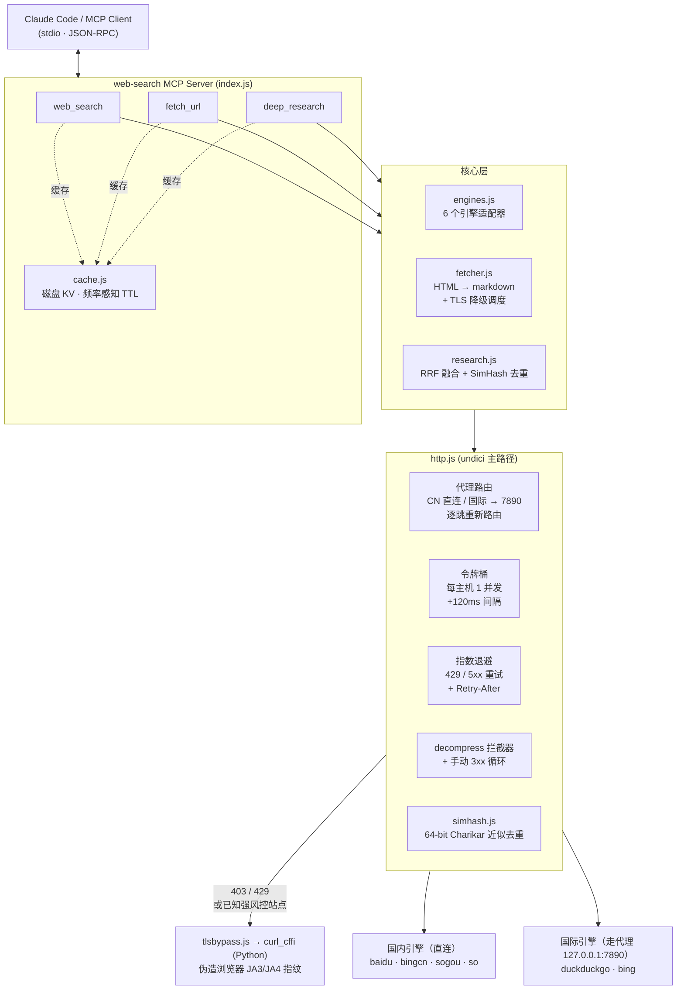
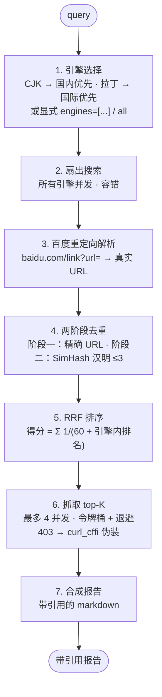

# web-search MCP server

[](https://modelcontextprotocol.io)
[](https://nodejs.org)
[](#license)

自建的 **Web 搜索 MCP server**，面向 Claude Code / 任意 MCP 客户端。多引擎（国内直连 + 国际自动走代理），三个工具，优化均基于国际论文：RRF 融合排序、SimHash 近似去重、每主机限速退避、频率感知缓存、TLS/JA3 指纹伪装降级。

[English](./README.md)

---

## 特性

- **6 引擎** — DuckDuckGo / Bing（国际，走代理）+ Bing 中国版 / 百度 / 搜狗 / 360（直连）。按查询语言自动选择。
- **3 工具** — `web_search`、`fetch_url`、`deep_research`（多引擎扇出 → 去重 → 排序 → 抓取 → 带引用报告）
- **代理自动路由** — 国内主机直连，国际主机走 `127.0.0.1:7890`；重定向时逐跳重新判定。
- **RRF 融合排序**（`k=60`）跨引擎 —— 无需分数归一化，鲁棒。
- **SimHash 去重** — 64-bit，汉明距离 ≤3，合并跨主机转载。
- **每主机令牌桶 + 指数退避** — 对抗基于频率的反爬检测。
- **磁盘缓存** 频率感知 TTL（搜索 30min / 新闻 1h / 文档 7d）。
- **TLS/JA3 伪装** 经 `curl_cffi`，突破 Cloudflare 等强风控站点（如 `docs.anthropic.com`）。

---

## 架构



### `deep_research` 流水线



---

## 原理

### 1. 代理自动路由（CN 直连 / 国际走代理）

`src/http.js` 维护国内域名后缀表（`baidu.com` / `bing.com` / `so.com` 等）。请求时按主机名后缀判定：

- 命中国内域名 → 直连（走代理反而更慢、且易被国内站风控）
- 国际域名 → 走 `127.0.0.1:7890` 代理（绕过宿主机境外网络问题）
- 重定向时**逐跳重新判定**：国际站 301 到国内 CDN 不会继续走代理
- `engine.search()` 也可用 `forceProxy` / `forceDirect` 强制覆盖（如 DuckDuckGo 必须走代理）
- 设 `PROXY_URL=""` 可禁用代理（如已开全局 VPN）

### 2. RRF 融合排序（Reciprocal Rank Fusion）

`src/research.js`。每条结果得分 = Σ_engine `1/(k + rankᵢ)`，`k=60`。

- **无监督**：无需分数归一化，对引擎结果数不均鲁棒
- **多引擎共识**：出现在多个引擎且排名靠前的结果自然排前
- query 词命中标题仅作 1e-4 量级 tiebreaker，不覆盖跨引擎共识
- k=60 是 Cormack et al. (2009) 与 ranx.fuse 的标准默认值

### 3. SimHash 近似去重

`src/simhash.js`。64-bit SimHash（Charikar 算法），分词用 FNV-1a 哈希 + unigram/bigram。

- 两阶段：先精确 URL 合并，再 SimHash 汉明距离 ≤3 视为近似重复
- 指纹**不含 host**：专门合并跨主机转载（同一新闻被不同门户转载、百度/Bing 同一结果不同 URL 包装）
- 验证：同文不同 host 距离 0，改写后距离 11，无关内容距离 36——区分有效

### 4. 每主机令牌桶 + 指数退避（抗频繁访问检测）

`src/http.js`。每主机：

- 并发 1 + 请求间隔 ≥120ms（`HOST_BUCKETS`）
- 瞬时错误（429/502/503/504）+ 网络异常：指数退避 `500·2^attempt + 随机抖动`，最多 2 次
- 尊重 `Retry-After` 响应头
- 异主机仍并行（不牺牲吞吐）

直接对应"频繁访问检测"主因——同主机高频请求。

### 5. 结果缓存 + 频率感知 TTL（增量）

`src/cache.js`。磁盘 JSON KV，按站点更新频率设 TTL：

| 站点类型 | TTL | 依据 |
|---|---|---|
| 搜索引擎结果页（baidu/bing/ddg…） | 30 min | 结果排序变动快 |
| 新闻聚合（163/sina/cctv/reuters…） | 1 h | 高频更新 |
| 文档/API/百科（docs./wikipedia/arxiv…） | 7 d | 内容稳定 |
| 其他 | 6 h | 默认 |

- `web_search` / `fetch_url` / `deep_research` 命中缓存直接返回（带 `_cached (age Nmin, ttl Mmin)_` 标记）
- 仅在有结果时缓存（空结果不缓存，下次重试）
- 设 `CACHE_DISABLED=1` 可禁用；`CACHE_DIR` 可改缓存目录
- 依据：频率感知增量爬取（2010）——按页面更新频率决定刷新间隔

### 6. TLS/JA3 指纹伪装降级（curl_cffi）

`src/tlsbypass.js` + `src/fetcher.js`。Node undici 的 TLS ClientHello 与真实浏览器不同，强风控站点（Cloudflare 保护的 `docs.anthropic.com` 等）会返回 403。`curl_cffi`（Python）可伪装浏览器 JA3/JA4 指纹 + HTTP/2 设置。

策略：

- **快路径**：默认用 undici（快、原生）
- **已知硬骨头站点**（`docs/platform.anthropic.com` 等）：直接走 curl_cffi
- **通用降级**：undici 遇 403/429 或网络异常 → 自动降级到 curl_cffi；都失败则如实报错（含 `impersonated` 标记）
- 报告里标注 `TLS: impersonated (curl_cffi)` 或 `native (undici)`
- 需 Python + `pip install curl_cffi`；未装时降级为纯 undici（不影响主流程）
- 依据：*TLS Beyond the Browser*（ACM IMC 2019）——非浏览器 TLS 客户端可被指纹识别，伪装可弥合

### 7. 引擎适配

| 引擎 | 区域 | 路由 | 说明 |
|---|---|---|---|
| duckduckgo | 国际 | 走代理 | `html.duckduckgo.com/html/` 免 key HTML 端点 |
| bing | 国际 | 走代理 | `setmkt=en-US&cc=US`，从 `<cite>` 还原真实 URL（绕过 `ck/a` 跳转包装） |
| bingcn | 国内 | 直连 | `cn.bing.com` |
| baidu | 国内 | 直连 | 检测验证码页报错，`mu` 属性取真实 URL |
| sogou | 国内 | 直连 | 移动端 + 桌面端双 fallback 绕过反爬 |
| so (360) | 国内 | 直连 | `www.so.com` |

查询含中日韩字符 → 默认国内引擎优先；纯拉丁 → 国际优先。`engine='all'` 全部并发。

### 8. undici v7 关键技术处理

- `interceptors.decompress()`：自动解压 gzip/br/deflate（Bing 国际版返回 brotli）
- **手动循环跟随 3xx**：undici v7 的 `request()` 不再接受 `maxRedirections`，且 `redirect` 拦截器单独不够（per-request opts 默认 0 会短路）。手动循环还能逐跳重新路由代理/直连。

---

## 工具

### `web_search`

```jsonc
{ "query": "anthropic claude api pricing", "num": 8, "engine": "auto" }
```

- `engine`: `auto`(默认) | `all` | `duckduckgo` | `bing` | `bingcn` | `baidu` | `sogou` | `so`

### `fetch_url`

```jsonc
{ "url": "https://example.com/page", "max_chars": 16000 }
```

抓页面正文转 markdown，按域名自动判定代理/直连，403 时降级到 TLS 伪装。

### `deep_research`

```jsonc
{
  "query": "中国空间站 最新进展",
  "engines": ["bingcn", "baidu"],
  "num_per_engine": 8,
  "fetch_top_k": 4,
  "fetch_chars": 6000
}
```

多引擎并发 → 去重排序 → 抓取正文 → 带引用 markdown 报告。

---

## 安装

### 前置

- **Node.js ≥ 18**
- **Python 3** + `curl_cffi`（可选，用于强风控站点的 TLS 伪装）：

  ```bash
  pip install curl_cffi
  ```

- `127.0.0.1:7890` 上的代理（如 Clash）——设 `PROXY_URL=""` 可禁用。

### 构建

```bash
git clone git@github.com:nuoyax/web-search-mcp.git
cd web-search-mcp
npm install
```

### 接入 Claude Code

用户级（所有项目可用）：

```bash
claude mcp add web-search -s user -e PROXY_URL=http://127.0.0.1:7890 \
  -- node /absolute/path/to/web-search-mcp/index.js
```

或加到 `.mcp.json`（项目级）：

```json
{
  "mcpServers": {
    "web-search": {
      "command": "node",
      "args": ["/absolute/path/to/web-search-mcp/index.js"],
      "env": { "PROXY_URL": "http://127.0.0.1:7890" }
    }
  }
}
```

### 验证

```bash
node index.js          # 启动 MCP server（stdio）
node test-smoke.js     # 各引擎 + fetch 冒烟测试
```

---

## 环境变量

| 变量 | 默认 | 作用 |
|---|---|---|
| `PROXY_URL` | `http://127.0.0.1:7890` | 代理地址；设为空字符串禁用代理 |
| `CACHE_DISABLED` | `0` | 设 `1` 禁用结果缓存 |
| `CACHE_DIR` | `./cache` | 缓存目录 |

---

## 引用的论文

实现中参考的国际论文（DOI 可查，检索自 OpenAlex 学术 API + DuckDuckGo/Bing）：

### 结果融合 / 排序

| 论文 | 年份 | 用途 | DOI |
|---|---|---|---|
| ranx.fuse: A Python Library for Metasearch | 2022 (CIKM) | RRF 实现参考，25 种融合算法 | [10.1145/3511808.3557207](https://doi.org/10.1145/3511808.3557207) |
| Comparing Rank and Score Combination Methods for Data Fusion in IR | 2005 | CombMNZ 等融合法对比，RRF k 值依据 | [10.1007/s10791-005-6994-4](https://doi.org/10.1007/s10791-005-6994-4) |
| The use of MMR, diversity-based reranking | 1998 (Carbonell) | 多样性重排奠基（待落地） | [10.1145/290941.291025](https://doi.org/10.1145/290941.291025) |
| Fusion-based methods for result diversification in web search | 2018 (Information Fusion) | 融合 + 多样性结合 | [10.1016/j.inffus.2018.01.006](https://doi.org/10.1016/j.inffus.2018.01.006) |

### 近似去重

| 论文 | 年份 | 用途 | DOI |
|---|---|---|---|
| A Review for Weighted MinHash Algorithms | 2018 | MinHash/SimHash 综述 | [10.48550/arxiv.1811.04633](https://doi.org/10.48550/arxiv.1811.04633) |
| Improved Near-Duplicate Detection for Aggregated and Paywalled News | 2025 (NAACL) | 近似去重新进展 | [10.18653/v1/2025.naacl-industry.73](https://doi.org/10.18653/v1/2025.naacl-industry.73) |
| Effective and Fast Near Duplicate Detection via Signature-Based | 2016 | 签名去重工程实现 | [10.1155/2016/3919043](https://doi.org/10.1155/2016/3919043) |

### 并行 / 增量爬取 / 限速

| 论文 | 年份 | 用途 | DOI |
|---|---|---|---|
| BUbiNG: Massive Crawling for the Masses | 2016 | 每主机礼貌队列、线性扩展 | [10.48550/arxiv.1601.06919](https://doi.org/10.48550/arxiv.1601.06919) |
| SIMHAR — Smart Distributed Web Crawler for the Hidden Web | 2020 (IEEE Access) | 分布式队列 + SIM+Hash 去重 | [10.1109/access.2020.3004756](https://doi.org/10.1109/access.2020.3004756) |
| Design of a Priority Based Frequency Regulated Incremental Crawler | 2010 | 频率感知增量爬取（缓存） | [10.5120/23-131](https://doi.org/10.5120/23-131) |
| On the Feasibility of Geographically Distributed Web Crawling | 2008 | 地理分布降低单点延迟 | [10.4108/icst.infoscale2008.3550](https://doi.org/10.4108/icst.infoscale2008.3550) |

### 反爬 / 封禁规避

| 论文 | 年份 | 用途 | DOI |
|---|---|---|---|
| TLS Beyond the Browser | 2019 (ACM IMC) | TLS/JA3 指纹暴露（P1） | [10.1145/3355369.3355601](https://doi.org/10.1145/3355369.3355601) |
| FP-Crawlers: Studying the Resilience of Browser Fingerprinting | 2020 | 浏览器指纹识别 | [10.14722/madweb.2020.23010](https://doi.org/10.14722/madweb.2020.23010) |
| A First Look at User-Installed Residential Proxies | 2024 (CNSM) | 住宅代理生态（代理池，待落地） | [10.23919/cnsm62983.2024.10814519](https://doi.org/10.23919/cnsm62983.2024.10814519) |

> 完整优化方案与差距分析见 [`docs/optimization-research.md`](./docs/optimization-research.md)。

---

## 项目结构

```
web-search-mcp/
├── index.js              # MCP server 入口（注册 3 工具，stdio）
├── src/
│   ├── http.js           # HTTP 层 + 代理路由 + 令牌桶 + 退避
│   ├── engines.js        # 6 引擎适配
│   ├── fetcher.js        # HTML→markdown + TLS 降级调度
│   ├── research.js       # RRF 融合 + SimHash 去重流水线
│   ├── simhash.js        # 64-bit Charikar SimHash
│   ├── cache.js          # 磁盘 KV 频率感知 TTL
│   └── tlsbypass.js      # curl_cffi TLS 伪装桥接
├── test-smoke.js         # 冒烟测试
├── docs/
│   ├── optimization-research.md
│   ├── architecture.svg
│   └── pipeline.svg
├── .mcp.json             # 项目级 MCP 注册
└── package.json
```

---

## 已知限制

- 所有网络请求 20-25s 超时，不会卡死。
- 百度偶尔触发验证码拦截，此时该引擎报错，`deep_research` 自动用其他引擎兜底。
- Bing 国际版结果链接是 `bing.com/ck/a` 跳转包装，从结果块 `<cite>` 还原真实 URL。
- DuckDuckGo 用 `html.duckduckgo.com/html/` 免 key HTML 端点，需走代理。
- TLS 伪装依赖 Python + `curl_cffi`。未安装时降级为纯 undici，强风控站点（如 `docs.anthropic.com`）会 403；安装后自动恢复。
- 缓存按 TTL 过期，不主动后台刷新；过期后下次调用重新抓取。设 `CACHE_DISABLED=1` 可禁用。

---

## License

MIT
